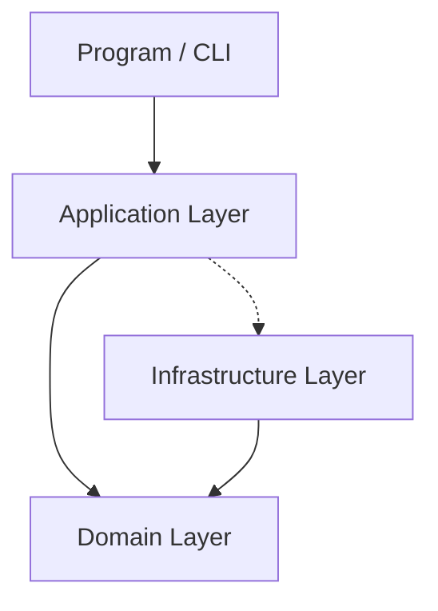

# Kennis - Multilingual Static Site Generator

**Kennis** (Dutch for *Knowledge*) is a high-performance, multilingual static site generator built with .NET. It is designed to transform dynamic content into lightning-fast, SEO-optimized static websites with a focus on clean architecture and modularity.

## 🚀 Why Use Kennis?

- **Multilingual by Design**: Built from the ground up to support multiple languages within the same project.
- **Clean Architecture**: Implements a robust 3-layer architecture (Domain, Application, Infrastructure) to ensure maintainability and testability.
- **Template Flexibility**: Separation of templates and content allows for easy design changes without affecting data.
- **Markdown Support**: Write your content in simple Markdown, and let Kennis handle the rest via [Markdig](https://github.com/lunet-io/markdig).
- **SEO Optimized**: Automatically handles slug generation, canonical structures, and metadata.

## 📁 Project Structure

Kennis follows **Clean Architecture** principles to decouple business logic from infrastructure concerns:



- **`src/Domain`**: The core of the application. Contains business models (`Project`, `Content`, `Template`), interfaces, enums, and constants. It has zero dependencies on other layers.
- **`src/Application`**: Contains orchestration services, business rules, and mappers. This layer implements the core use cases.
- **`src/Infrastructure`**: Implementation of external concerns such as File System IO (Persistence) and Logging.
- **`src/resources`**: Global resources like localized log messages.

## 🛠️ Getting Started

### Prerequisites
- .NET 8.0 SDK or later.

### Configuration
1. Open `src/config.json` to set your global settings:
   ```json
   {
     "language": "en",
     "logLevel": "verbose"
   }
   ```
2. Define your project in a `project.json` file inside the `projects` folder.

### Running the Generator
To build a project, run the following command from the `src` directory:
```bash
dotnet run -- build YourProjectName
```

## 📝 Content & Templates

### Content
Content is written in Markdown with YAML frontmatter for metadata:
```markdown
---
title: My First Post
description: A short description of the post
categories: [Dev, .NET]
tags: [Kennis, SSG]
created: 2026-04-15
published: 2026-04-15
---
# Hello World
This is my first post generated with Kennis!
```

### Templates
Templates are defined in JSON, mapping logic to HTML files:
- **`index.html`**: The main landing page.
- **`page.html`**: Default layout for generic pages.
- **`blog.html`**: Layout for the blog index.
- **`post.html`**: Layout for individual blog posts.

## 📜 License
This project is licensed under the MIT License - see the [LICENSE](LICENSE) file for details.
